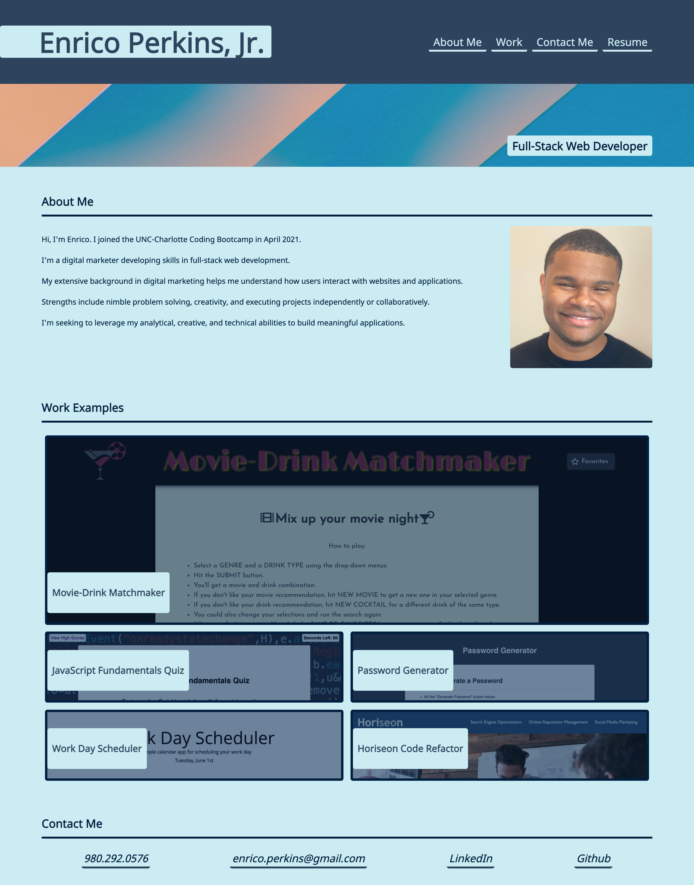

# Personal Portfolio Website

## Description

For this project, I created a portfolio website so potential employers could learn more about me. I accomplished this by:
1. Creating an HTML stucture with semantic HTML elements.
2. Creating a CSS file to match the new semantic HTML structure
3. Adding necessary content such as navigation, an about me section with a profile photo, project images/links, and contact information.
4. Making the website mobile-responsive.

Link to live webpage: [Portfolio Website](https://evperkinsjr.github.io/portfolio-website/)

## Screenshot

## Technologies Used

- HTML
- CSS
